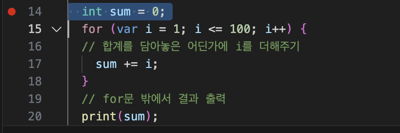

# 플러터 아침 스터디 기록

- 시작일자 : 2025년 11월 03일

## 목표
- [x] git 맛보기
- [ ] git 마스터
- [ ] 다트 마스터
- [ ] 플러터 마스터
왼쪽 익스텐션

## Repostory에 올리는 법
### 최초일 때
1. 깃허브 레포지토리 만들기
2. 바탕화면에 폴더 만들기
3. VSCode에서 폴더 열고 올릴 파일 만들기
4. 저장소 초기화
   - `git init` (비뚤어진 '를 쓰면 코드쓰는데 씀. 처음 한번만 쓰면 됨! 이후엔 git add . / git commit -m 이렇게 사용하면 됨)
   - 초기화 하게되면 `.git` 폴더가 생긴다
5. 임시영역(스테이징 영역)에 파일 추가하기
   - 명령어 : `git add .`
   - `add` 뒤에 `.`은 현재 폴더 내의 모든 파일을 의미
   - 현재 폴더는 여기에서 터미널을 열면 이 폴더 내에 있는 모든게 임시영역에 올라가게 됨
   - 현재 폴더는 터미널에서의 작업 영역
   - 맥에서 터미널 열어서 `git add .` 눌러도 안됨. 앞에 ~가 있는데 폴더 지정이 안되서 안된다,
   터미널에서 pwd 누르면 현재 폴더기 표시.(안나옴) `.git`폴더가 있는곳에서 반드시 해야된다.
6. 브랜치에 기록하기(최종 저장)
  - 명령어 : `git commit -m "커밋메시지"`
  - 커밋매시지는 어떠한 변경사항이 있었는지 메모용도
7. '원격 저장소' 연결(깃허브)
   '로컬 저장소'는 브랜치
   원격저장소 명령어(레포지토리 하단 3줄)
   ```sh
    git remote add origin https://github.com/joohyelim1208/flutter-study-9.git
    git branch -M main
    git push -u origin main
   ```
   (오리진이 메인 브랜치 -u가 로컬 브랜치. 로컬을 메인으로 올라가게 하겠다는 뜻)
8. 깃허브에 올리기 push(레포지토리 위에 줄 복사해서 붙여야 되는데 7.번에 포함되어 있어서 안해도 됨)
  - 명령어 : `git push origin main`
    `git push`까지만 입력하고 엔터하면 깃허브에 업로드 완료!

### 이후
1. 임시영역(스테이징 영역)에 파일 추가하기
   - 명령어 : `git add .`
   - `add` 뒤에 `.`은 현재 폴더 내의 모든 파일을 의미
   - 현재 폴더는 터미널에서의 작업 영역
2. 브랜치에 기록하기(최종 저장)
  - 명령어 : `git commit -m "커밋메시지"`
  - 커밋매시지는 어떠한 변경사항이 있었는지 메모용도
3. 깃허브에 올리기 push(7번에 포함되어 있어서 안해도 됨)
  - 명령어 : `git push origin main`


## 꿀팁
- 맥에서 Option버튼 + 벡틱 누르면 한글일 때도 벡틱이 입력된다
- 영어 옵션 + ~ 하면 `
- 정리는 선택하고 탭버튼 하면 정렬됨!
- 터미널에서 사용하는 명령어는 sh ```옆에 표기해 줌
- 커맨드 + j 누르면 터미널 열림 >pwd 쳐봐서 확인해보기
- 파일 숨김파일 보면 .git 파일 보임
- vs코드에서 제일 위에 동그란 점이 파일명 위에 보이면 저장이 안된것. 커맨드 + s 해서 항상 저장하기
- 하단 터미널에서 컨트롤 c 하면 새로 입력 가능
- pwd 입력하고, git init 초기화 시켜주면 상단 왼쪽에 U 표시가 뜸. git add . 입력하면 바뀜 정상적으로 처리
git commit -m "제목을 입력"
- 위에 코드 34~36번째 줄 터미널에 입력하면 연동됨!
- 옵션+커맨드+화살표 위/아래 : 멀티라인 선택해서 늘리고 줄이고 됨!!!
- 시프트 + 탭 : 왼쪽으로 정렬됨

- 식을 일일히 다 안 적어도 됨!!!!
문 하나 적으면 아래 네모난게 뜨는데 그거 선택하면 코드가 전체가 자동으로 완성됨~! (안에 있는 내용만 수정하면 됨)
ㄴ switch, for문 만들 때 VSCode 자동완성 기능 활용해서 가능
첫번째꺼 선택하면 '문자' 자동완성
두번째꺼 '숫자' 자동완성

-플로터에서 >next find match 검색하면 문자열을 맞춰줌!!
ㅇ :
ㅇㅇ :
ㅇㅇㅇ :

-중간에 파일 수정하고 저장하려면~
하단 터미널에서 파일명 다 안쳐도 됨. git add RE까지만 치고 탭 2번 누르면 파일명 자동 완성!! 엔터 누르고 왼쪽 가지모양 가서 commit누르기 git에 업로드 완료.

-변수명 잘 짓기.. 주석을 달아놔야 설명이 됨
/// (도큐멘테이션 주석///) main 함수가 프로그램의 시작점
-옵션+시프트+F : 자동 정렬
-커맨드+시프트+화살표 위/아래: 줄 정렬하기

-숫자 좌측 옆에 마우스 대면 빨간점 뜨는데 그 부분까지  한줄씩 디버그 모드로 실행된다는 뜻.
어떤 문제가 발생했는지 보기 쉬움!!
-커맨드+시프트+4 : 빨간점 뜨면서 캡쳐식으로 선택할 수 있음. 커맨드+S: 저장
 옆에 새폴더 하나 만들고 'images' 커맨드 C+V 하면 이미지파일 붙여넣기 가능함
-코드 라인수 옆에 클릭해서 빨간점(브레이크 포인트) 만들면 `디버그모드`에서 해당줄부터 한줄씩 실행하면서 변수 확인 가능 



이렇게 하면 Git 마크다운 폴더에 이미지가 저장된다!!! 
저장 후 확인: 우클릭- 마크다운 프리뷰